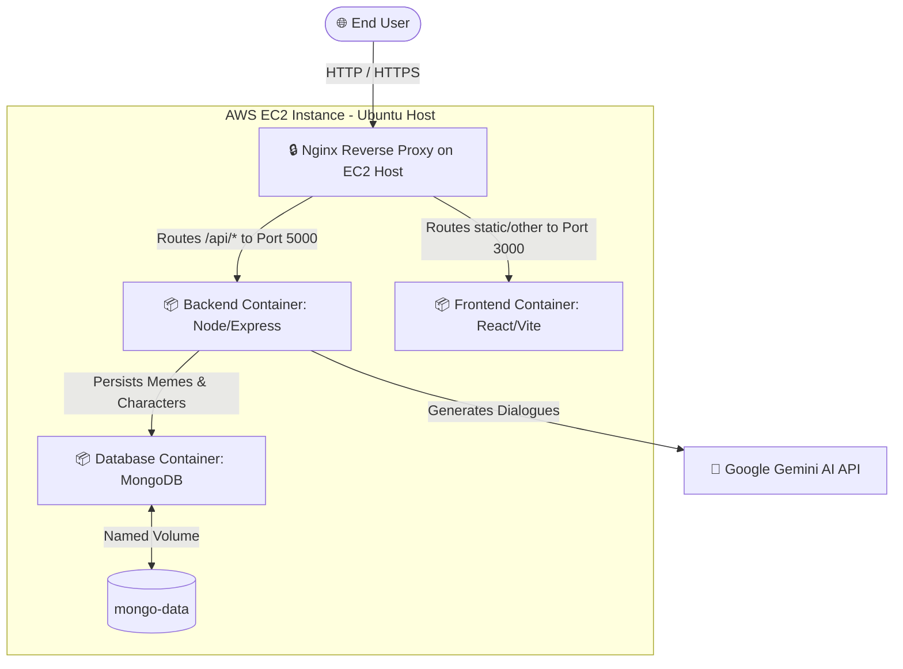

# 🚀 CID Meme Verse: Multi-Tier Containerized Web App with CI/CD & AI Generation

[](https://github.com/anuj-gope/Cid/actions)
[](https://hub.docker.com/repository/docker/anujgope/cid-meme-backend)
[](https://hub.docker.com/repository/docker/anujgope/cid-meme-frontend)
[](http://ec2-host.com)

**CID Meme Verse** is a production-grade, 3-tier web application designed to generate, gallery, and vote on pop-culture memes inspired by India's legendary TV series *CID*. The application leverages a cutting-edge stack (React, Node.js, Express, MongoDB) integrated with Google's Gemini Generative AI for automated, context-aware dialogue generation.

This repository serves as a showcase for **Enterprise DevOps Practices**, featuring optimized Docker multi-stage builds, container orchestration, comprehensive automated test suites (Jest + Vitest), and a robust **CI/CD pipeline** that automatically builds, tests, pushes, and deploys the entire application stack to an **AWS EC2** instance upon every git push.

---

## 🏗️ System & Deployment Architecture

The application is built using a modern 3-tier architecture, fully decoupled, containerized, and deployed behind a reverse proxy.



### 📡 Network & Infrastructure Routing
1. **Host-Level Reverse Proxy (Nginx)**: The entry point of the AWS EC2 instance. It acts as an SSL terminator and traffic router. 
   - Requests starting with `/api` are reverse-proxied to the **Backend Container** (running on port `5000`).
   - All other traffic is routed to the **Frontend Container** (running on port `3000`), which serves the optimized production assets.
2. **Container Network Isolation**: The application containers live in a single bridge network defined in `docker-compose.yml`. They communicate securely via service-name DNS (e.g., the Backend connects to the database via `mongodb://mongodb:27017/mydb` rather than exposing database ports publicly).
3. **Data Persistence**: Database files are decoupled from the MongoDB container lifecycle using a named Docker volume (`mongo-data`), ensuring high availability and zero data-loss during deployments or container restarts.

---

## ☸️ DevOps & Infrastructure Highlights 

This project was built to illustrate production DevOps workflows:

### 1. ⚙️ Continuous Integration (CI)
* **Automated Quality Gates**: The pipeline triggers on pushes to the `main` branch. It sets up Node.js v20 in a containerized environment, installs dependencies, and runs:
  * **Backend Unit & Integration Tests**: Jest and Supertest are used to validate the API endpoints (e.g., verifying character fetching, database responses, and API status codes).
  * **Frontend Component Tests**: Vitest is used to render the React tree and assert proper rendering of UI elements (e.g., verifying that the app mounts successfully and the navigation works).
* **Build-Once, Run-Anywhere**: If all tests pass, the pipeline proceeds to the build phase, preventing broken or buggy code from reaching staging/production.

### 2. 🐳 Multi-Stage Dockerization
* **React Frontend Dockerfile (Multi-Stage Build)**:
  * **Build Stage**: Uses `node:18-alpine` to compile the Vite static assets. Accepts build-time argument `VITE_API_URL` to inject backend host IP dynamically.
  * **Production Stage**: Uses a lightweight static server (`serve` utility) to run the static React bundle. The final image size is reduced by **over 70%** because dev-dependencies, Node package managers, and raw source code are excluded from the runtime container.
* **Backend Dockerfile**: Engineered using `node:18-alpine` as a minimal base image, ensuring a minimal vulnerability footprint and extremely fast container spin-up times. Layer caching is optimized by copying `package*.json` and running `npm install` prior to copying source code.

### 3. 🚀 Continuous Deployment (CD)
* **GitHub Actions Deploy Runner**: Upon successful build, the workflow logs into Docker Hub securely using secrets, builds target images, tags them, and pushes them to the public/private registry.
* **Remote Deployment via SSH**: The deploy job uses `appleboy/ssh-action` to securely execute a deployment shell script on the AWS EC2 instance.
* **Zero-Downtime Deployment Flow**:
  1. SSHs into the EC2 instance.
  2. Runs `docker compose pull` to download the newly pushed images from Docker Hub.
  3. Re-creates the containers gracefully in detached mode using `docker compose down && docker compose up -d`, ensuring minimal downtime during service swap.

---

## 🛠️ Tech Stack & Dependencies

### 💻 Frontend
* **Core**: React 18, Vite (Fast build tool)
* **Styling**: Tailwind CSS v4, Shadcn/ui (Accessible buttons & layout components)
* **Testing**: Vitest, JSDOM, `@testing-library/react`

### ⚙️ Backend
* **Runtime**: Node.js, Express.js
* **Database Client**: Mongoose (MongoDB ODM)
* **AI Orchestration**: `@google/generative-ai` (Google Gemini Pro integration for context-aware CID dialog generation)
* **Testing**: Jest, Supertest

### 🌐 Infrastructure & DevOps Tools
* **Platform**: AWS EC2 (Ubuntu 22.04 LTS)
* **Containerization**: Docker, Docker Compose
* **CI/CD Orchestration**: GitHub Actions
* **Image Registry**: Docker Hub
* **Reverse Proxy**: Nginx

---

## 🚀 Getting Started & Local Development

Follow these steps to run the complete 3-tier application in your local environment.

### 📋 Prerequisites
* Install [Docker](https://docs.docker.com/get-docker/) & [Docker Compose](https://docs.docker.com/compose/install/).

---

### 🐳 Running with Docker Compose (Recommended)

This is the simplest way to run the entire multi-container stack locally.

#### 1. Clone the repository
```bash
git clone https://github.com/anuj-gope/Cid.git
cd Cid
```

#### 2. Configure Environment Variables
Create a `.env` file inside the `backend/` directory:
```bash
touch backend/.env
```
Add the following content:
```env
MONGO_URL=mongodb://mongodb:27017/mydb
GEMINI_API_KEY=your_actual_google_gemini_api_key
```

#### 3. Build and Spin Up the Stack
Run the following command at the root of the project:
```bash
docker compose up --build -d
```
This command builds the frontend and backend Docker images, downloads the official MongoDB image, establishes the network, and runs the containers in detached mode.

#### 4. Seed the Database
To populate your MongoDB database with CID characters (ACP Pradyuman, Abhijeet, Daya, etc.) and their famous dialogues, run the seed script inside the backend container:
```bash
docker exec -it backend node seed.js
```

#### 5. Verify the Application
* **Frontend**: Open `http://localhost:3000` in your browser.
* **Backend API**: Verify by visiting `http://localhost:5000/api`.
* **MongoDB**: Accessible locally on `localhost:27017`.

---

### 💻 Running Locally (Bare-Metal / Development Mode)

If you wish to run the app outside of Docker containers for active development:

#### 1. Run the Database
Ensure MongoDB is running locally on port `27017`.

#### 2. Start the Backend Service
```bash
cd backend
npm install

# Create a local .env file
echo "MONGO_URL=mongodb://localhost:27017/mydb" > .env
echo "GEMINI_API_KEY=your_gemini_key" >> .env

# Seed initial data
npm run seed  # runs 'node seed.js'

# Start dev server
node server.js
```
The backend API is now running at `http://localhost:5000`.

#### 3. Start the Frontend React App
```bash
cd ../frontend
npm install
npm run dev
```
Vite will start the client on `http://localhost:5173` (or another port outputted in the terminal). 
*Note: For local development, ensure Vite's server proxy routes `/api` requests to `http://localhost:5000`.*

---

## 📊 CI/CD Workflow Setup (GitHub Actions to AWS EC2)

To replicate this deployment pipeline in your own cloud account:

### 1. Set Up the Target EC2 Instance
1. Launch an Ubuntu EC2 instance on AWS and allow ports `80` (HTTP), `22` (SSH), `5000` (Backend API), and `3000` (Frontend Web) in the Security Group.
2. Install Docker and Docker Compose on the host:
   ```bash
   sudo apt update
   sudo apt install docker.io docker-compose -y
   sudo usermod -aG docker ubuntu && newgrp docker
   ```
3. Create a directory named `app` in the home directory (`/home/ubuntu/app`) and place the project's `docker-compose.yml` file there. This is where the CD SSH action will run command workflows.

### 2. Configure Nginx Reverse Proxy on the EC2 Host
Install Nginx:
```bash
sudo apt install nginx -y
```
Create a configuration file at `/etc/nginx/sites-available/cid-meme`:
```nginx
server {
    listen 80;
    server_name your-ec2-public-ip-or-domain;

    # Frontend Routing
    location / {
        proxy_pass http://127.0.0.1:3000;
        proxy_set_header Host $host;
        proxy_set_header X-Real-IP $remote_addr;
        proxy_set_header X-Forwarded-For $proxy_add_x_forwarded_for;
        proxy_set_header X-Forwarded-Proto $scheme;
    }

    # Backend API Routing
    location /api/ {
        proxy_pass http://127.0.0.1:5000/api/;
        proxy_set_header Host $host;
        proxy_set_header X-Real-IP $remote_addr;
        proxy_set_header X-Forwarded-For $proxy_add_x_forwarded_for;
        proxy_set_header X-Forwarded-Proto $scheme;
    }
}
```
Link the file and restart Nginx:
```bash
sudo ln -s /etc/nginx/sites-available/cid-meme /etc/nginx/sites-enabled/
sudo systemctl restart nginx
```

### 3. Add GitHub Repository Secrets
Navigate to **Settings > Secrets and variables > Actions** in your GitHub repository and add the following repository secrets:
* `DOCKER_USERNAME`: Your Docker Hub username.
* `DOCKER_PASSWORD`: Your Docker Hub personal access token or password.
* `EC2_HOST`: The public IP or DNS domain name of your AWS EC2 instance.
* `EC2_USER`: The SSH username (usually `ubuntu` for Ubuntu Server).
* `EC2_SSH_KEY`: The raw private SSH key (`.pem` file) used to authenticate access to your EC2 instance.

Once configured, pushing changes to the `main` branch will automatically execute the end-to-end pipeline: **Test ➡️ Containerize ➡️ Upload to Registry ➡️ SSH Deploy ➡️ Restart Container Stack**.

---

## 🧪 Automated Test Execution

You can run the built-in test suites locally to ensure system integrity.

### 🧪 Running Backend Unit/Integration Tests
The backend uses Jest and Supertest to assert server behavior.
```bash
cd backend
npm test
```

### 🧪 Running Frontend Component/DOM Tests
The frontend uses Vitest to execute React unit tests.
```bash
cd frontend
npm test -- --run
```

---

## 📈 Production-Ready Architectural Enhancements 


1. **Production-Grade Secret Management**: Transition away from storing `.env` files manually on the EC2 host. Suggest migrating to **AWS Secrets Manager** or **HashiCorp Vault**, where credentials (such as the Gemini API Key) are fetched dynamically at runtime.
2. **Container Security & Vulnerability Scanning**: Integrate **Trivy** or **Anchore** scanning into the GitHub Actions CI pipeline to scan built Docker images for high/critical vulnerabilities before pushing them to Docker Hub.
3. **Infrastructure as Code (IaC)**: Replace the manual setting up of the AWS EC2 instance and Nginx reverse proxy with **Terraform** or **AWS CloudFormation** to achieve fully reproducible environment provisioning.
4. **Transition to Serverless Container Orchestration**: Discuss migrating from Docker Compose to **AWS ECS with Fargate** or **AWS EKS (Kubernetes)** to achieve auto-scaling, high availability across multiple availability zones, and native rolling update strategies.
5. **Monitoring and Observability Stack**: Propose mounting a Prometheus container alongside the stack to scrape Node.js API metrics (`express-prom-bundle`) and database metrics, visualized on a centralized **Grafana Dashboard** for real-time monitoring and alerting.

---

## 📜 License
This project is licensed under the MIT License - see the LICENSE file for details.

---

*Made with 💻, 🐳, and plenty of "Kuch toh gadbad hai..." dialogues by the CID Forensic Lab!*
